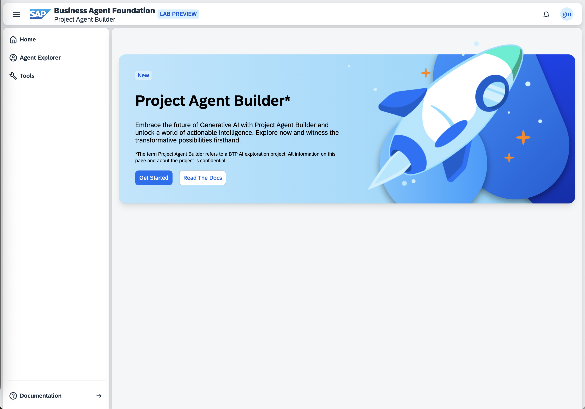

# Step 1: Setup

1. **Welcome to the Agent Setup Guide**. By accessing this documentation, you have initiated the first step of the setup process, confirming you are in the correct location.

2. Navigate to the Agent Playground by accessing the following URL: https://url.sap/sapphire-building-agents

3. When prompted to select an authentication provider, choose the top entry "httpsbtpai.accounts.ondemand.com" as shown in the image below:
   

4. Enter the credentials that were provided to you to authenticate and access the system.

5. Once logged in, locate and click the "Get Started" button on the welcome page:
   

6. **Excellent!** You are now successfully authenticated for the Agent Playground. This environment will allow you to create and test your own agents. Please proceed to [Step 2](../02-create-agent) to continue with the setup process.