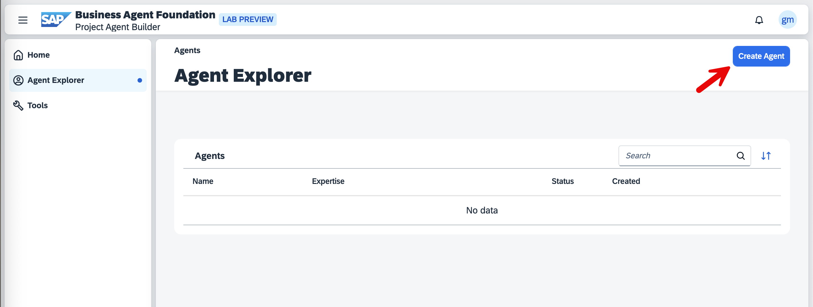
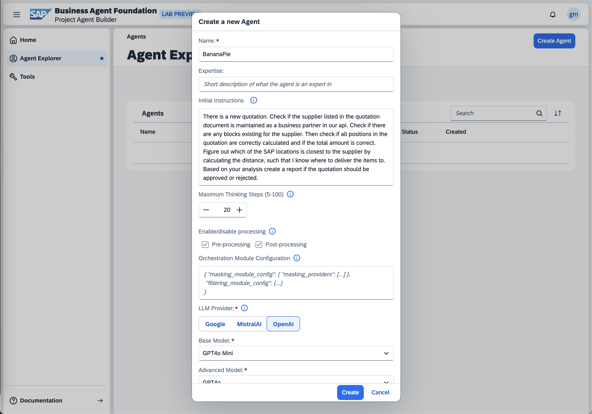

# Step 2: Create Your Agent 

1. Select the *Create Agent* button located in the top right corner of the Agent Playground interface.
   

2. Configure your agent by providing the following information:
   - **Name**: Enter your login name or create a distinctive name of your choice. Please note that this name will be visible to other participants in the Agent Playground.
   - **Initial Instructions**: This will serve as the foundation for your agent's behavior. You can use the provided template below or modify it to observe how different instructions influence your agent's responses:
   ```
   There is a new quotation. Check if the supplier listed in the quotation document is maintained as a business partner in our API. 
   Check if there are any blocks existing for the supplier. 
   Then check if all positions in the quotation are correctly calculated and if the total amount is correct. 
   Figure out which of the SAP locations is closest to the supplier by calculating the distance, such that I know where to deliver the items to.
   Based on your analysis create a report if the quotation should be approved or rejected.
   ```

3. Complete the creation process by clicking the *Create* button.
   

4. Upon successful creation, you will be automatically redirected to your agent's detail page.
   Please proceed to [Step 3](../03-add-tools) to continue the configuration process.