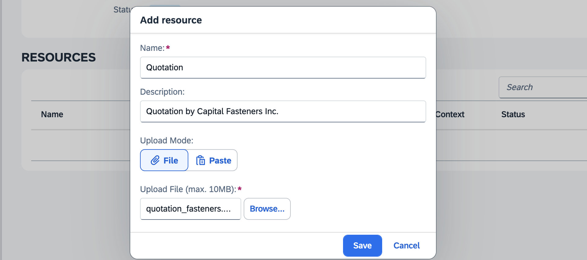

# Step 3: Add Tools

By integrating tools, we enhance our agent's capabilities. Our objective is to equip the agent with the ability to read documents, access SAP APIs, perform calculations, and utilize web search functionality.

1. Select the *Add Tool* button located in the top right corner of the Agent Playground interface.
   

2. Add the following tools to your agent:

   1. **Calculator**
      - Select the *Calculator* tool type from the drop-down menu.
      - Assign a name of your preference, such as *Calculator*.
      - Complete the process by clicking the *Create* button.

   2. **OpenAPI**
      - Select the *OpenAPI* tool type from the drop-down menu.
      - Assign a name of your preference, such as *Business Partner API*.
      - Specify the destination: `Business_Partner`
      - Ensure only the GET method is selected.
      - Insert the OpenAPI specification from the file [API_BUSINESS_PARTNER.json](API_BUSINESS_PARTNER.json) located in this directory.
      - Complete the process by clicking the *Create* button.
      

   3. **Web Search**
      - Select the *Web Search* tool type from the drop-down menu.
      - Assign a name of your preference, such as *SAP Search*.
      - Set the domain constraint to `www.sap.com` to restrict searches to official SAP content only.
      - Complete the process by clicking the *Create* button.

   4. **Document**
      - Select the *Document* tool type from the drop-down menu.
      - Assign a name of your preference, such as *Documents*.
      - Complete the process by clicking the *Create* button.
      - From the tools section, select your newly created Document tool.
      - In the *Resources* section, click the *Add* button.
      
      - Download the [Quotation](quotation_fasteners.pdf) file from this directory and upload it to the document tool.
      - Provide a descriptive name and explanation for the document, such as *Quotation*. This information will help the agent identify the document correctly.
      - Complete the process by clicking the *Save* button.
      

3. Congratulations! You have successfully integrated all necessary tools with your agent. Proceed to Step 4 to evaluate your agent's capabilities.