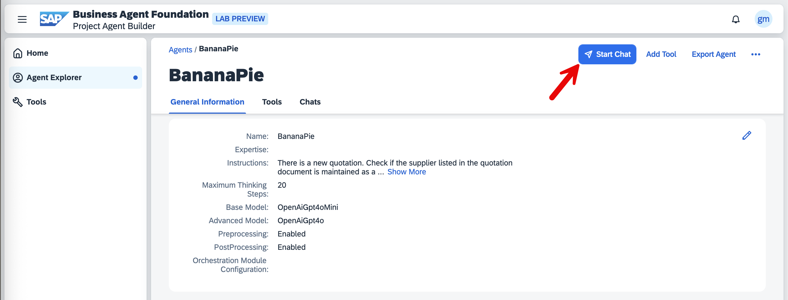

# Step 4: Send Messages
Now it's time to test the agent you've created.

1. Navigate back to your agent's detail page by selecting the agent name in the top left corner.

2. Select the *Start Chat* button located in the top right corner of the Agent Playground interface.


3. Send your first message to the agent. You can use this simple prompt:
```
Analyze the new quotation.
```

4. The agent will acknowledge your request and begin processing. Please allow a few seconds for the analysis to complete.
   Once finished, the agent will provide you with a comprehensive report on the quotation document.

5. To further explore your agent's capabilities, try sending additional messages. For example:
   - Ask about different suppliers
   - Inquire about alternative SAP locations
   - Request specific details from the quotation

6. We encourage you to experiment with various prompts and observe how your agent responds. This exploration will help you understand the full range of your agent's capabilities and how it processes different types of requests.

### Thank you for participating!
This concludes the hands-on session. You have successfully:
- Created an agent
- Enhanced it with specialized tools
- Tested its analytical capabilities

Feel free to continue exploring the Agent Playground, trying different configurations, and experimenting with additional tools to expand your understanding of the platform's potential.